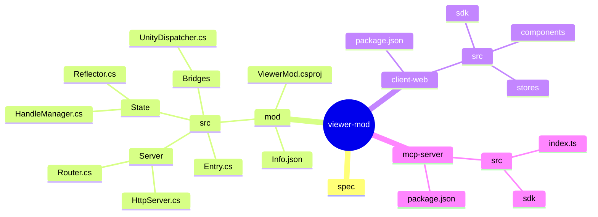

# Project Structure & Implementation Plan (Draft)

## 1. Directory Structure
Keep three components separate so they can iterate independently: the in-game mod, the web UI, and the MCP adapter.

## 2. Implementation Steps

### Phase 1: The Core Mod Server (C#)
1.  **Scaffold Project**: Create `.csproj` targeting .NET 4.7.2 (copy from extractor mod)
2.  **HTTP Listener**: Use `System.Net.HttpListener` on localhost (default port 5000)
3.  **Main Thread Dispatching**: Queue in `MonoBehaviour.Update()` loop
4.  **Handle Registry**: GUID → object map (single global registry)
5.  **Object Inspector**: Reflection with Public + Internal visibility
6.  **Core API**: Implement `/api/roots`, `/api/inspect`, `/api/handles/clear`
7.  **Info.json**: UnityModManager manifest

Note: tests assume `http://localhost:5000`. Only add `scripts/test-config.json` if you intentionally run the server elsewhere (see [TEST_PLAN.md](TEST_PLAN.md)).

### Phase 2: The MCP Server
1.  **Setup**: Initialize TypeScript project with `@modelcontextprotocol/sdk`
2.  **Shared SDK**: Create TypeScript client for game server HTTP API
3.  **Tools**: Implement `game_list_roots`, `game_inspect_object`, `game_clear_handles`
4.  **Testing**: Verify agent can navigate from roots to specific objects via Copilot

### Phase 3: The Web Client
1.  **Scaffold**: Vite + React + TypeScript app
2.  **SDK Integration**: Use shared TypeScript client library
3.  **Object Tree**: Recursive tree component with expand-on-click
4.  **Inspect View**: Display member names, types, values
5.  **Collection Handling**: Display count + list of elements

### Phase 4 (Later): Live Debugger
Add WebSocket-based observation/subscriptions and UI primitives for reactive updates.

## 3. Technology Stack (Confirmed)
*   **Mod Framework**: UnityModManager (UMM) with `Info.json` manifest
*   **HTTP Server**: `System.Net.HttpListener` (available in .NET 4.7.2)
*   **JSON**: Newtonsoft.Json (already in game's Managed folder)
*   **Target Framework**: .NET Framework 4.7.2
*   **Unity Integration**: MonoBehaviour with Update() loop for main thread work
*   **Web Client**: React + Vite + TypeScript
*   **MCP Server**: Node.js + TypeScript + @modelcontextprotocol/sdk
